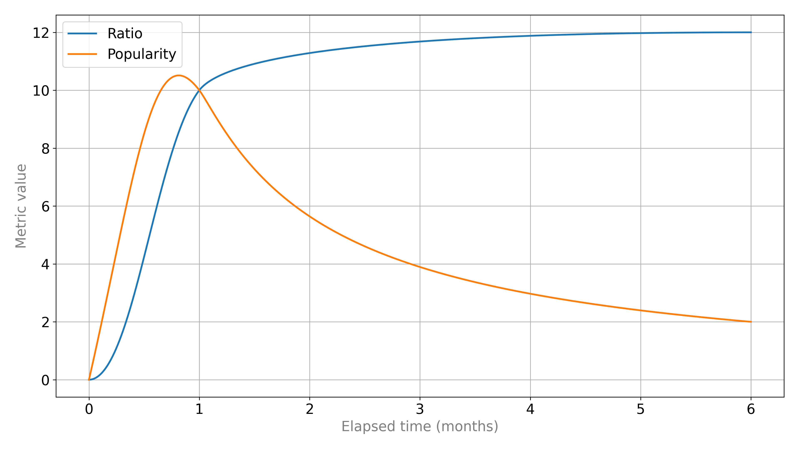

# Popularity metric plot 📉


A helper script that draws a correlation plot for a prototype of a brand new [Popularity](https://github.com/qbittorrent/qBittorrent/pull/20180) metric for [qBittorrent](https://github.com/qbittorrent/qBittorrent).



## Supported Python versions
This script works with Python 3.8-3.11. It doesn't support Python 3.12 since `bezier` is [not yet available](https://github.com/dhermes/bezier/pull/315) for 3.12.

## Installation
```bash
python -m venv .venv
source .venv/bin/activate
pip install -r requirements.txt
```

## Usage
```
$ python plot.py --help
usage: plot.py [--save PATH] [--font-size FONT_SIZE] [--dpi DPI] [--line-width LINE_WIDTH] [--width WIDTH] [--height HEIGHT] [--help]

Draws a metric correlation plot

options:
  --save PATH, -s PATH  save the plot as a file
  --font-size FONT_SIZE
                        font size
  --dpi DPI             image DPI
  --line-width LINE_WIDTH, -l LINE_WIDTH
                        plot line width
  --width WIDTH, -w WIDTH
                        image width
  --height HEIGHT, -h HEIGHT
                        image height
  --help                show this help message and exit
```

## Examples
To show a plot in an interactive UI, run:
```bash
python plot.py
```
To render a customized plot directly to a file, run:
```bash
python plot.py -s assets/plot.png --font-size 16 --dpi 300
```
